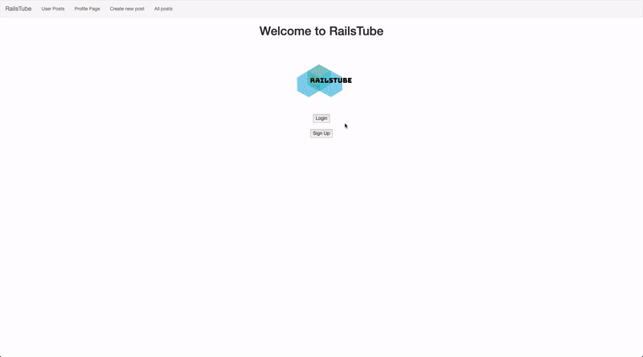

# RailsTube

Blog site allowing users to create blogs and interact with other users blogs

## Technologies used
Ruby on Rails, SQLite3, Bcrypt, Erb.

## Features
- Creating a blog post
- Commenting on another user's blog post
- Adding other users as friends
- Uploading videos with your post
- View all posts from other users

# Demo


## Installation
> Installation assumes that you are using OS X or Linux
> We will also be using homebrew. Recommend to install [Homebrew](https://brew.sh/)
> Installations will be for both frontend and backend

## Instructions
Make a new directory, then change into that directory. Within that directory:

Clone the project on your local machine
```bash
git clone git@github.com:jolouie7/RailsTube.git
```
Change into the directory
```bash
cd RailsTube
```
Install dependencies by using [bundler](https://bundler.io/guides/rails.html)
```bash
bundle install
```

Create your database, migrate, and seed data
```bash
rails db:create
rails db:migrate
rails db:seed
```
Start your rails server
```bash
rails s
```

## To view app in development mode
Go to http://localhost:3000/ while the server is running

## Contributing
Pull requests are welcome. For major changes, please open an issue first to discuss what you would like to change.

## License
[MIT](https://choosealicense.com/licenses/mit/)
